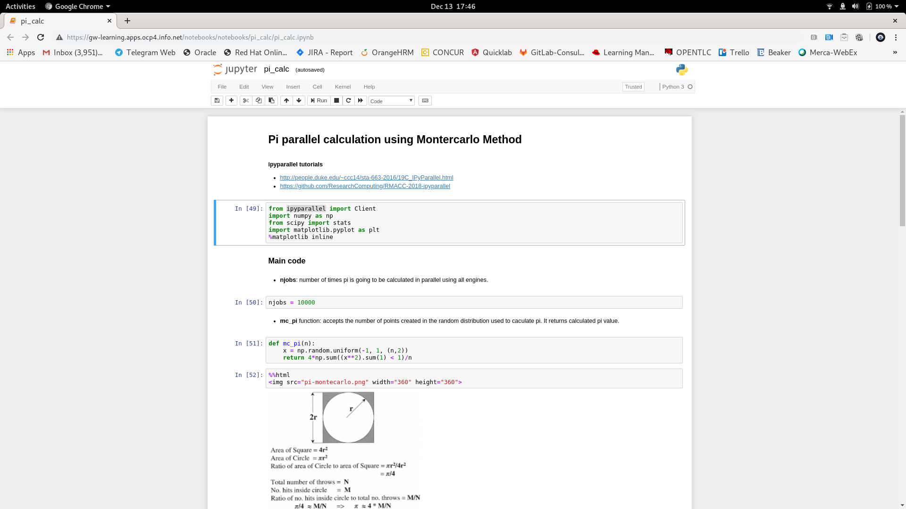

# openshift-python-mpi

## OpenShift
Instructions for setting this up on OpenShift

### Set up the project

Get the project
```bash
$ git clone https://github.com/bchardim/openshift-python-mpi
$ cd openshift-python-mpi
```

Create Openshift Project
```bash
$ oc new-project gw-learning
```

Create the persistent shared storage needed for MPI cluster operation. In this case we are going to use NFS in RWX mode.
```bash
$ oc create -f storage/nfs-mpi-pv.yaml
persistentvolume/nfs-pv-mpi created

$ oc create -f storage/nfs-mpi-pvc.yaml
persistentvolumeclaim/nfs-pvc-mpi created

$ oc get pvc
NAME          STATUS   VOLUME       CAPACITY   ACCESS MODES   STORAGECLASS   AGE
nfs-pvc-mpi   Bound    nfs-pv-mpi   2Gi        RWX                           3s
```

Create the SSH information
```bash
$ bash scripts/generate-mpi-configs.sh
$ bash scripts/generate-ssh-configs.sh
$ bash scripts/create-config-maps-and-secrets.sh
```
Create the OpenShift resources
```bash
$ oc process -f mpi-template.yml -p MPI_POD_CPU=1 -p MPI_POD_CPU_LIMIT=2 -p MPI_POD_MEMORY=512Mi -p MPI_POD_MEMORY_LIMIT=1024Mi -p MPI_BASE_IMAGE_URI=https://github.com/bchardim/openshift-python-mpi | oc create -f -
```

### Run MPI Job

Run a sample job against  6 mpi pod cluster
```bash
$ oc scale dc mpi --replicas 6 && oc wait dc mpi --for condition=available

$ cd scripts
$ ./run-mpi-script-against-ocp-mpi-pods.sh mpi/mpi-hello-world.py
```

Calculate pi using 18000000 points against 6 mpi pod cluster
```bash
$ oc scale dc mpi --replicas 6 && oc wait dc mpi --for condition=available

$ cd scripts
$ ./run-mpi-script-against-ocp-mpi-pods.sh mpi/pi_mpi_calc.py 18000000
...
...
Calculated pi is 3.1415404000, error is 0.0000522536
```


### Run MPI/ipyparallel Job using Jypiter Notebook

Get project route
```bash
$ oc get routes
NAME               HOST/PORT                        PATH   SERVICES         PORT    TERMINATION   WILDCARD
mpi-master-route   gw-learning.apps.ocp4.info.net          mpi-master-svc   <all>   edge          None
```

Execute sample notebook that calculates pi in parallel against deployed mpi cluster using Monte Carlo method

https://gw-learning.apps.ocp4.info.net/notebooks/notebooks/pi_calc/pi_calc.ipynb 



Enjoy !

## References
https://github.com/itewk/openshift-mpi-example


